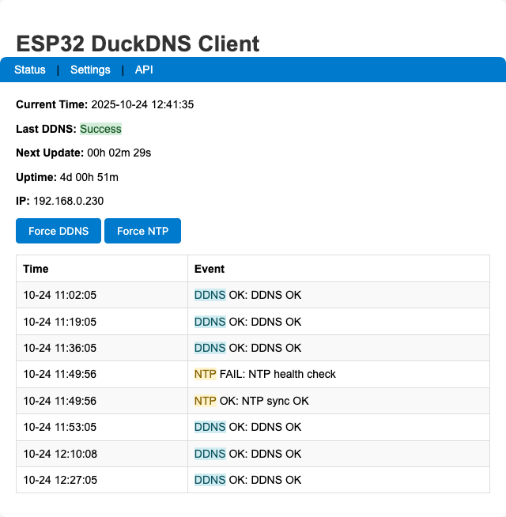
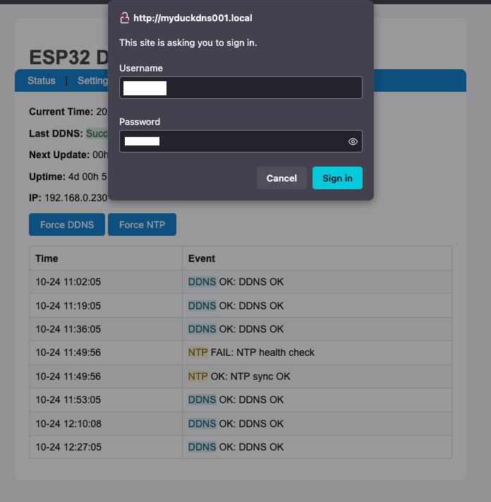
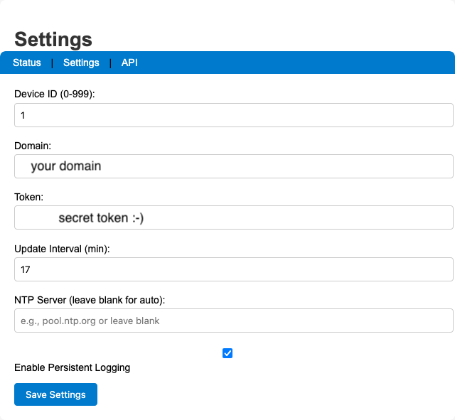
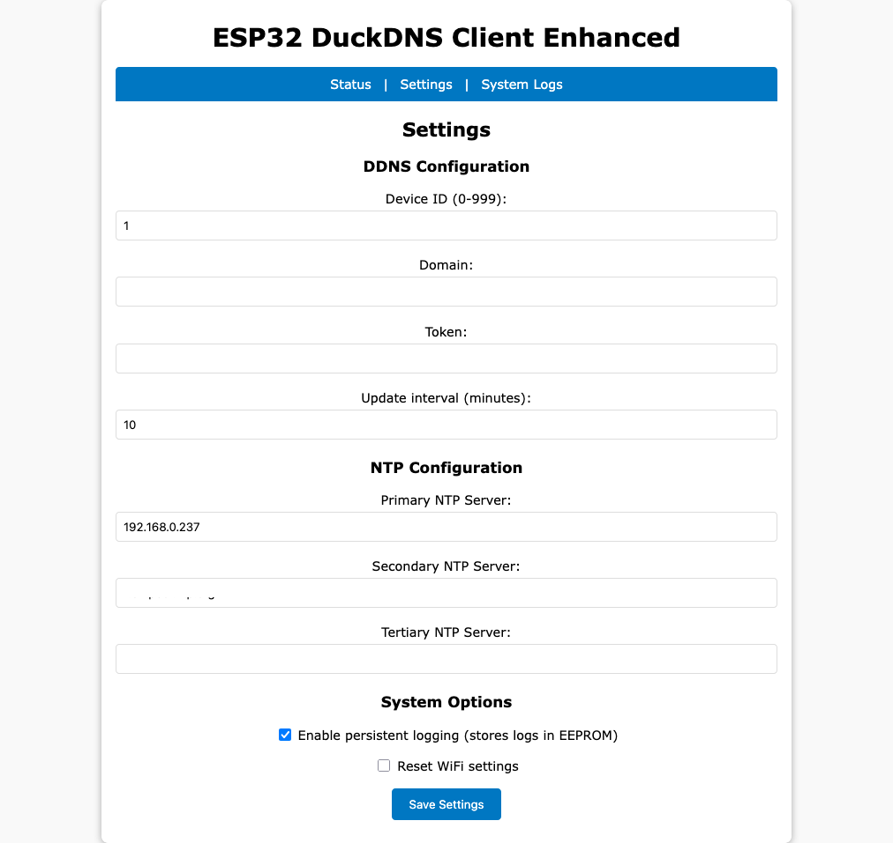
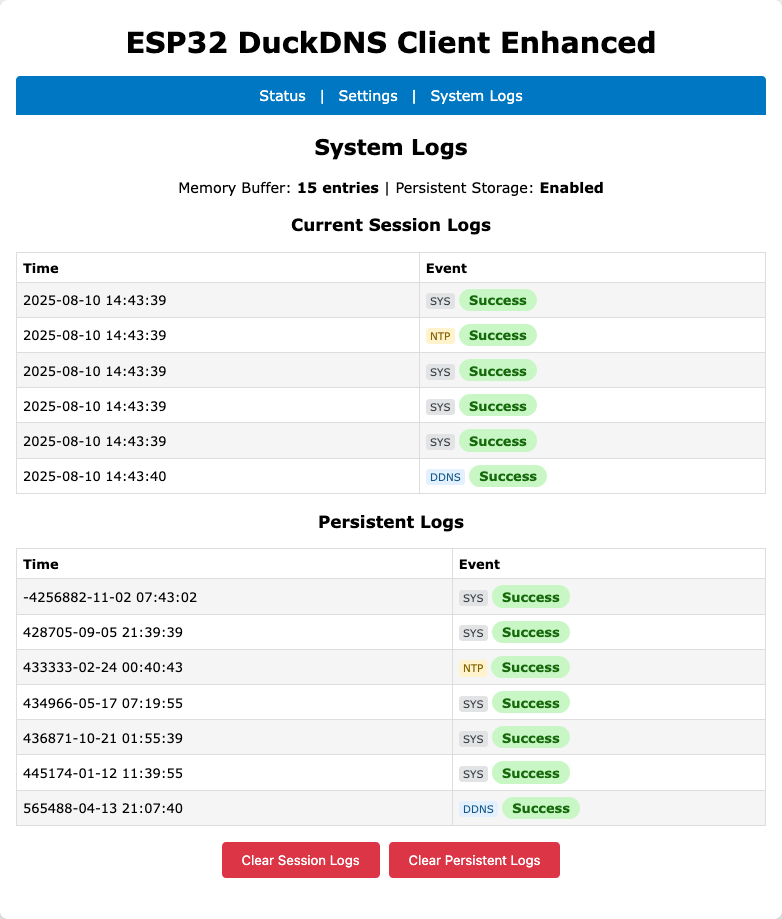

# ESP32 DuckDNS Client (Enhanced) 🦆

This project is an open-source, standalone Dynamic DNS (DDNS) client for **DuckDNS.org** that runs on an **ESP32** microcontroller. This enhanced version is a complete overhaul, offering a robust, feature-rich, and secure solution to keep your DuckDNS domain pointed to your home's dynamic IP address.

It was adapted from the original ESP8266 DuckDNS client created by Davide Gironi @davidegironi (https://davidegironi.blogspot.com/2017/02/duck-dns-esp8266-mini-wifi-client.html).

**Version with NTP and persisting logging**



---

## Features

* **ESP32 Compatible**: Runs on the powerful and versatile ESP32 platform.
* **WiFi Manager**: No need to hardcode WiFi credentials. On first boot, it creates an access point for you to easily connect it to your local network.
* **Modern Web Interface**: A clean, mobile-responsive web interface to:
    * View detailed DDNS and NTP (Network Time Protocol) status.
    * See device uptime, IP address, and WiFi signal strength.
    * Force manual DDNS or NTP syncs.
* **Secure Configuration**: The settings page is password-protected (`user` / `pass`) to prevent unauthorized changes.
* **Advanced Time Management**:
    * Robust NTP synchronization with primary and fallback servers.
    * Accurate, timestamped logging. Logs created before time sync are automatically updated with an estimated timestamp.
* **Persistent Logging**: Option to save system and update logs to the ESP32's internal flash, preserving them across reboots.
* **Detailed Logging**: View both current session and persistent logs directly from the web interface, with clear success/fail indicators and event types (DDNS, NTP, System).
* **JSON API**: A comprehensive API endpoint provides the device's status in a JSON format, perfect for integration with systems like Home Assistant.
* **Without memory leaks :-)**: Refactored persistent storage code to use the ESP32 Preferences library.
* **Automatic Reboots can be programmed**

---

## Setup & Installation

### 1. Hardware

* An ESP32 Development Board (e.g., ESP32-DevKitC, NodeMCU-32S).

### 2. Software & Libraries

1.  Make sure you have the **Arduino IDE** installed with the **ESP32 board support package**.
2.  Install the following libraries through the Arduino Library Manager (`Sketch` > `Include Library` > `Manage Libraries...`):
    * `WiFiManager` by tzapu
    * `Ticker` by sstaub

### 3. Flashing the Code

1.  Open the `esp32duckdns_withapi$version.ino` file in the Arduino IDE or a compatible editor like VS Code with the PlatformIO extension.
2.  Select your ESP32 board from the `Tools` > `Board` menu.
3.  Select the correct COM port under the `Tools` > `Port` menu.
4.  Click the "Upload" button.

---

## How to Use

### First-Time WiFi Setup

The first time you power on the ESP32, it will automatically enter configuration mode.

1.  Using your phone or computer, scan for new Wi-Fi networks.
2.  Connect to the network named **`ESP32-DuckDNS-Enhanced`**.
3.  A captive portal page should automatically open in your browser. If not, open a browser and navigate to `192.168.4.1`.
4.  Click on **"Configure WiFi"**, select your home network (SSID), and enter its password.
5.  Click **"Save"**. The ESP32 will save the credentials, reboot, and automatically connect to your home network.

### Device Configuration





Once the device is connected to your network, you need to configure it.

1.  Find the device's IP address by:
    * Checking the "Connected Devices" list on your router's admin page. The hostname will be **`testduckXXX`** (where `XXX` is the Device ID).
    * Monitoring the Serial Output in the Arduino IDE when the device boots up.
2.  Open a web browser and enter the ESP32's IP address.
3.  You'll see the status page. Click the **"Settings"** link.
4.  You will be prompted for a username and password. Enter the defaults:
    * **Username**: `user` (these are configurable within the first 20 lines of code)
    * **Password**: `pass`
5.  On the settings page, you can configure:
    * **DuckDNS Domain** and **Token**.
    * **Update Interval** in minutes.
    * Primary, Secondary, and Tertiary **NTP Servers**.
    * Enable/Disable **Persistent Logging**.
    * Optionally reset WiFi settings on the next boot.
6.  Click **"Save Settings"**. The device will save your settings and reboot.






That's it! The ESP32 is now fully configured.


---

## Home Assistant Integration

You can integrate the client with Home Assistant using the RESTful sensor platform. The API endpoint at `http://[device_ip]/api/status` provides a detailed JSON response.

### API Response

The API returns a rich JSON object, perfect for creating multiple sensors in Home Assistant.

```json
{
  "status": "success",
  "last_update": 1754857330,
  "next_update": 458,
  "ip": "192.168.0.7",
  "rssi": -54,
  "uptime": 142,
  "time_synced": true,
  "ntp_attempts": 1,
  "ntp_last_sync": 23000,
  "persistent_logging": true,
  "log": [
    {
      "time": 1754857211,
      "local_time": 21345,
      "status": "success",
      "type": "SYS",
      "timestamp_valid": true,
      "error": "Web server started on port 80"
    },
    {
      "time": 1754857330,
      "local_time": 140123,
      "status": "success",
      "type": "DDNS",
      "timestamp_valid": true,
      "error": "DDNS update successful"
    }
  ]
}
