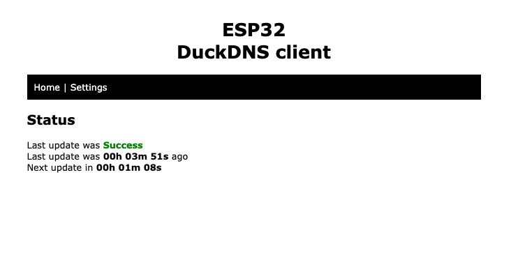
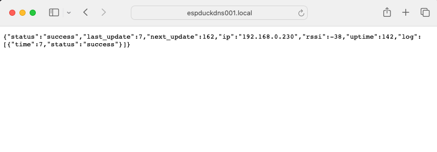
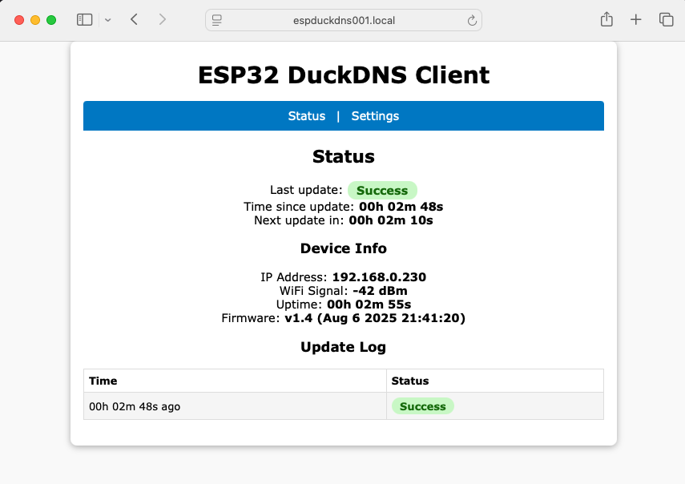

# ESP32 DuckDNS Client 🦆

This project is an open-source, standalone Dynamic DNS (DDNS) client for **DuckDNS.org** that runs on an **ESP32** microcontroller.

It was adapted from the original ESP8266 DuckDNS client created by Davide Gironi. This version provides a simple, "set-it-and-forget-it" solution to keep your DuckDNS domain pointed to your home's dynamic IP address.



---

## Features

* **ESP32 Compatible**: Runs on the powerful and versatile ESP32 platform.
* **WiFi Manager**: No need to hardcode WiFi credentials! On first boot, it creates an Access Point for you to easily connect it to your local network.
* **Web Interface**: After setup, the device hosts a simple web page to:
    * View the current update status.
    * See when the last successful update occurred.
    * Configure your DuckDNS domain, token, and update interval.
* **Persistent Settings**: All settings (WiFi credentials, domain, token) are saved to the ESP32's internal flash (EEPROM) and survive reboots and power loss.
* **Status LED**: The onboard LED provides a visual status of the WiFi connection and DDNS update process.
* **Simple API**: A new API endpoint provides the device's status in a JSON format, allowing for integration with other systems like Home Assistant.

---

## Setup & Installation

### 1. Hardware

* An ESP32 Development Board (e.g., ESP32-DevKitC, NodeMCU-32S).

### 2. Software & Libraries

1.  Make sure you have the **Arduino IDE** installed with the **ESP32 board support package**.
2.  Install the following libraries through the Arduino Library Manager (`Sketch` > `Include Library` > `Manage Libraries...`):
    * `WiFiManager` by tzapu
    * `Ticker` by sstaub

### 3. Flashing the Code

1.  Open the `${firemwarefile}.ino` sketch in the Arduino IDE.
2.  Select your ESP32 board from the `Tools` > `Board` menu.
3.  Select the correct COM port under the `Tools` > `Port` menu.
4.  Click the "Upload" button.

### 4. Choice of firmware

1. `esp32duckdns.ino` is the vanila version without extra functionalities.  
2. `esp32duckdns_withapi.ino` provides an api to get status of the service. Usefull to integrate in home assistant as rest api sensor.  
3. `esp32duckdns_withap_vclaude.ino` Refactored code from claude 3.5. New gui, more information in API, password protected configuration, and better code. 

---

## How to Use

### First-Time WiFi Setup

The first time you power on the ESP32, it won't know your WiFi credentials. It will automatically enter configuration mode.

1.  Using your phone or computer, scan for new Wi-Fi networks.
2.  Connect to the network named **`ESP32-DuckDNS-AP`**.
3.  A captive portal page should automatically open in your browser. If not, open a browser and navigate to `192.168.4.1`.
4.  Click on "Configure WiFi", select your home network (SSID), and enter its password.
5.  Click "Save". The ESP32 will save the credentials, reboot, and automatically connect to your home network. The `ESP32-DuckDNS-AP` network will now be gone.

### DuckDNS Configuration

Once the device is connected to your network, you need to tell it your DuckDNS details.

1.  Find the device's IP address. You can do this by:
    * Checking the "Connected Devices" list on your router's admin page. The hostname will be `espduckdnsXXX`.
    * Monitoring the Serial Output in the Arduino IDE when the device boots up.
2.  Open a web browser on the same network and enter the ESP32's IP address.
3.  You'll see the status page. Click the **"Settings"** link.
4.  Enter your **DuckDNS Domain** and **Token**.
5.  Set your desired **Update Interval** in minutes.
6.  Click **"Save"**. The device will save your settings and reboot.

That's it! The ESP32 will now automatically update your DuckDNS domain at the interval you specified.

---

## Home Assistant Integration

You can integrate the ESP32 DuckDNS client with Home Assistant to create a sensor that displays its status. The firmware provides a new API endpoint at `http://[device_ip]/api/status` that returns a JSON object with the status information.

### 1. The API Response

The API endpoint will return a JSON object similar to this:

```json
{
  "last_update_status": "Success",
  "last_update_ago": 120,
  "next_update_in": 300
}
```

## What's New in v1.4 

### New Features and Fixes

The updated ESP32 DuckDNS client, version 1.4, includes several key enhancements and fixes aimed at improving security and stability:

* **Security and Stability**: The code has been enhanced to address buffer overflow vulnerabilities and improve memory management.
* **Error Handling**: The client now features better error handling, including a retry mechanism for failed updates. When an update fails, the device will retry sooner.
* **Authentication**: An authentication layer has been added to the web interface, requiring a username and password (`admin` and `your_secure_password`) to access the settings page.
* **EEPROM Optimization**: The EEPROM usage has been optimized for storing persistent settings.
* **API Endpoint**: The API endpoint `http://[device_ip]/api/status` now provides a more detailed JSON response. It includes the `last_update_status`, `last_update_ago`, and `next_update_in`.
* **Logging**: A new update log feature stores the history of the last five DDNS updates, including their status and any error messages. This log is viewable on the web interface.
* **Firmware Information**: The web interface displays the firmware version and build date/time.


#### New API


#### GUI


#### Password for settings


#### Settings


### Setup and Use Updates

The instructions for using the client have been updated to reflect these changes:

* **DuckDNS Configuration**: To access the **"Settings"** page, you must now authenticate with the username `admin` and the password `your_secure_password`.
* **Validation**: The settings form now includes client-side validation to ensure the entered values for Device ID, Domain, Token, and Update Interval are within the correct ranges.
* **Reset WiFi Settings**: A new checkbox has been added to the settings page, allowing you to reset your WiFi credentials and re-enter configuration mode.