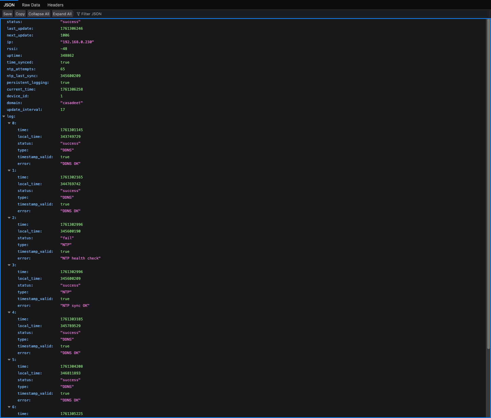

# ESP32 DuckDNS Client (Enhanced) 🦆

This project is an open-source, standalone Dynamic DNS (DDNS) client for **DuckDNS.org** that runs on an **ESP32** microcontroller. This enhanced version is a complete overhaul, offering a robust, feature-rich, and secure solution to keep your DuckDNS domain pointed to your home's dynamic IP address.


---

## License

This project is licensed under the MIT License. See the [LICENSE](LICENSE) file for details.
It was adapted from the original ESP8266 DuckDNS client created by Davide Gironi @davidegironi (https://davidegironi.blogspot.com/2017/02/duck-dns-esp8266-mini-wifi-client.html).

**Version with NTP and persistent logging**


---

## Configuration Stored in EEPROM

Config fields:
* Device ID (0–999)
* DuckDNS domain
* DuckDNS token
* Update interval (minutes)
* Optional custom NTP server
* Persistent logging flag

EEPROM details:
* Size: 512 bytes; init marker `0x10`
* Persistent log ring (20 entries) stored after the config block
* Batched commits (every 30s or on critical failure) to reduce wear

Defaults on first boot:
* `deviceid = 1`, `domain = "your-domain"`, `token = "your-token"`, `updateinterval = 10`, `ntpServer = "time.local"`, `persistentLogging = false`

---

## Security Notes

* Settings page protected with HTTP Basic Auth
  * Defaults: `user` / `pass`
  * Change in code: `ADMIN_USERNAME` / `ADMIN_PASSWORD`
* HTTPS to DuckDNS uses `setInsecure()` (no cert validation). For strict TLS, add certificate pinning to `WiFiClientSecure`.

---

## LED Status

GPIO 2 is used for status LEDs:
* WiFiManager AP mode: fast blink
* WiFi connecting: slow blink
* WiFi connected: steady on
* DDNS failure: DDNS LED blinks until next success

---

## Troubleshooting

* If NTP fails at boot, the system proceeds after ~2 minutes and retries via health checks (every 30 minutes).
* Ensure DuckDNS domain and token are correct on the Settings page.
* If mDNS (`.local`) doesn’t resolve, use the device IP.
* Use the Serial Monitor for detailed logs (baud 115200).

---

## Changelog (v6)

* Reduced EEPROM data sizes; total EEPROM size = 512 bytes
* Optional persistent logging to EEPROM with batched commits (30s or on critical failure)
* In-memory log ring (8 entries) and timestamp backfill after NTP sync
* NTP multi-server fallback and periodic health checks
* Memory pressure monitoring with defensive restart on very low heap
* Safer string handling and bounded buffers
* Simplified web UI and handlers; Basic Auth on Settings page
* Hostname derived from device ID: `testduckNNN`
### 2. Software & Libraries

1.  Make sure you have the **Arduino IDE** installed with the **ESP32 board support package**.
2.  Install the following libraries through the Arduino Library Manager (`Sketch` > `Include Library` > `Manage Libraries...`):
    * `WiFiManager` by tzapu
    * `Ticker` by sstaub

### 3. Flashing the Code

1. Open `firmware/esp32duckdns_v6.ino` in the Arduino IDE or a compatible editor like VS Code.
2. Select your ESP32 board from the `Tools` > `Board` menu.
3. Select the correct COM port under the `Tools` > `Port` menu.
4. Click the "Upload" button.

---

## How to Use

### First-Time WiFi Setup

The first time you power on the ESP32, it will automatically enter configuration mode.

1.  Using your phone or computer, scan for new Wi-Fi networks.
2.  Connect to the network named **`ESP32-DuckDNS`**.
3.  A captive portal page should automatically open in your browser. If not, open a browser and navigate to `192.168.4.1`.
4.  Click on **"Configure WiFi"**, select your home network (SSID), and enter its password.
5.  Click **"Save"**. The ESP32 will save the credentials, reboot, and automatically connect to your home network.

### Device Configuration


Once the device is connected to your network, you need to configure it.

1.  Find the device's IP address by:
    * Checking the "Connected Devices" list on your router's admin page. The hostname will be **`testduckXXX`** (where `XXX` is the Device ID).
    * Monitoring the Serial Output in the Arduino IDE when the device boots up.
2.  Open a web browser and enter the ESP32's IP address.
3.  You'll see the status page. Click the **"Settings"** link.
4.  You will be prompted for a username and password. Enter the defaults:
    * **Username**: `user` (these are configurable within the first 20 lines of code)
    * **Password**: `pass`
5.  On the settings page, you can configure:
  * **DuckDNS Domain** and **Token**
  * **Update Interval** (minutes)
  * **NTP Server** (optional; falls back to built-in servers)
  * **Persistent Logging** toggle
  * **Device ID** (used for hostname `testduckNNN`)
6.  Click **"Save Settings"**. The device will save your settings and reboot.

That's it! The ESP32 is now fully configured.


---

## Home Assistant Integration

* `/` — Status page (no authentication)
* `/settings` — Settings page (Basic Auth: `user` / `pass`)
* `/forcesync` — Force DDNS update (302 redirect to `/`)
* `/forcentp` — Force NTP sync (302 redirect to `/`)

---




```json
{
  "status": "success",
  "last_update": 1754857330,
  "next_update": 458,
  "ip": "192.168.0.7",
  "rssi": -54,
  "uptime": 142,
  "time_synced": true,
  "ntp_attempts": 1,
  "ntp_last_sync": 23000,
  "persistent_logging": true,
  "log": [
    {
      "time": 1754857211,
      "local_time": 21345,
      "status": "success",
      "type": "SYS",
      "timestamp_valid": true,
      "error": "Web server started on port 80"
    },
    {
      "time": 1754857330,
      "local_time": 140123,
      "status": "success",
      "type": "DDNS",
      "timestamp_valid": true,
      "error": "DDNS update successful"
    }
  ]
}
