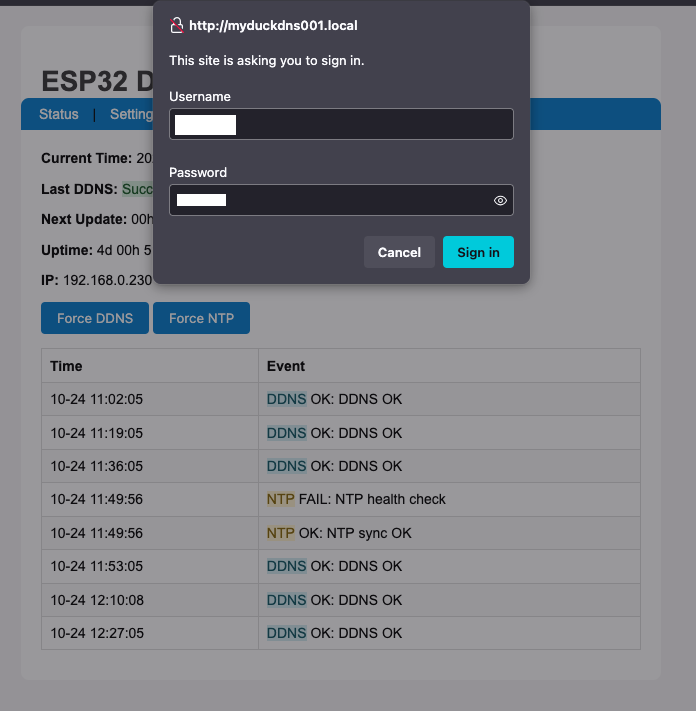
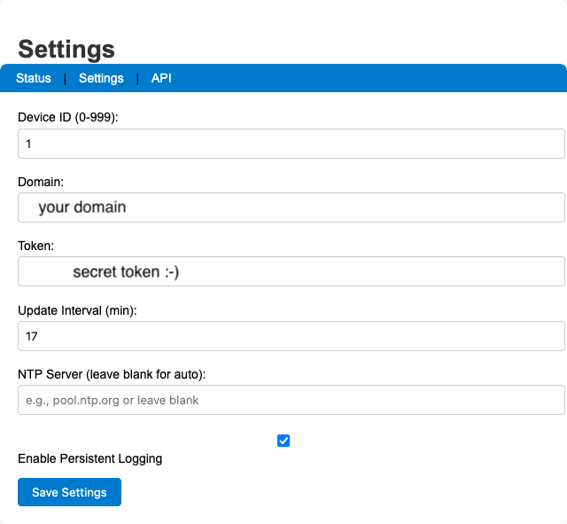
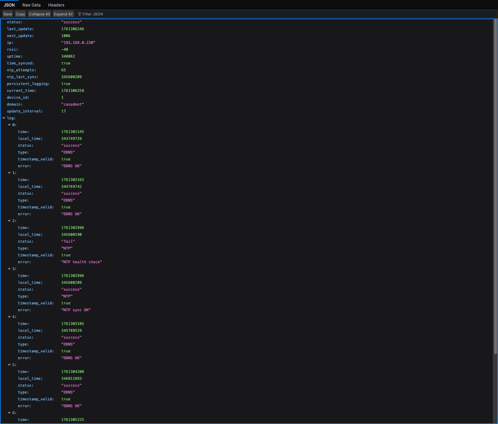

::: {.hero-banner}


**Standalone DDNS client** for [DuckDNS.org](https://www.duckdns.org) running on an **ESP32** microcontroller — no cloud service, no router dependency.
:::

## Overview

This project keeps your DuckDNS domain pointed at your home's dynamic IP address using an ESP32 as a dedicated, always-on device. Full-featured firmware with web UI, EEPROM persistence, NTP sync, and a JSON API — runs standalone, no Home Assistant required.

Firmware: `firmware/esp32duckdns.ino`

---

## Getting Started

### Hardware

Any ESP32 development board works. GPIO 2 is used for status LED output.

### Software & Libraries

::: {.callout-note}
Requires **Arduino IDE** with the **ESP32 board support package** installed.
:::

Install via Arduino Library Manager (`Sketch › Include Library › Manage Libraries…`):

| Library | Author |
|---------|--------|
| `WiFiManager` | tzapu |
| `Ticker` | sstaub |

### Flashing

1. Open `firmware/esp32duckdns.ino` in Arduino IDE
2. `Tools › Board` → select your ESP32 board
3. `Tools › Port` → select the correct COM port
4. Click **Upload**
5. Open Serial Monitor at **115200 baud**

---

## First-Time Setup

### WiFi Configuration

On first boot the ESP32 starts a captive portal:

1. Connect to the WiFi network **`ESP32-DuckDNS`** from any device
2. The captive portal opens automatically (or navigate to `192.168.4.1`)
3. Click **Configure WiFi**, select your network, enter the password
4. Click **Save** — the device reboots and connects

### Device Configuration

After connecting, find the device on your network:

- Router admin page: look for hostname **`testduckXXX`** (where `XXX` = Device ID)
- Serial monitor shows the assigned IP on boot

Open the IP in a browser → click **Settings** → log in with:

| Field | Default |
|-------|---------|
| Username | `user` |
| Password | `pass` |

Configure on the settings page:

- **DuckDNS Domain** and **Token**
- **Update Interval** (minutes)
- **NTP Server** (optional; falls back to built-in pool)
- **Persistent Logging** (EEPROM ring buffer, 20 entries)
- **Device ID** (0–999; sets hostname `testduckNNN`)

Click **Save Settings** — device reboots and starts updating.

---

## Web Interface

{.screenshot}

::: {.panel-tabset}

### Status Page

Shows current IP, last update time, next update countdown, NTP sync status, WiFi RSSI, and the in-memory log ring.

### Settings Page

{.screenshot}

{.screenshot}

Basic Auth protected (`user` / `pass` by default — change `ADMIN_USERNAME` / `ADMIN_PASSWORD` in the sketch before flashing).

### JSON API

`GET /api/status` — no authentication required.

{.screenshot}

```json
{
  "status": "success",
  "last_update": 1754857330,
  "next_update": 458,
  "ip": "192.168.0.7",
  "rssi": -54,
  "uptime": 142,
  "time_synced": true,
  "ntp_attempts": 1,
  "ntp_last_sync": 23000,
  "persistent_logging": true,
  "log": [
    {
      "time": 1754857211,
      "local_time": 21345,
      "status": "success",
      "type": "SYS",
      "timestamp_valid": true,
      "error": "Web server started on port 80"
    },
    {
      "time": 1754857330,
      "local_time": 140123,
      "status": "success",
      "type": "DDNS",
      "timestamp_valid": true,
      "error": "DDNS update successful"
    }
  ]
}
```

:::

---

## Architecture

### EEPROM Layout

| Offset | Content |
|--------|---------|
| `0` | `ddnsConfig` struct (~128 bytes), init marker `0x10` |
| `128` | Persistent log count (`int`) + `PersistentLogEntry[20]` ring |

- EEPROM capacity computed at runtime in `ddnsEEPROMinit()` and stored in `g_eepromCapacity`
- Writes are bounds-checked; if computed requirements exceed safe cap, persistent logging is disabled with a warning
- Commits are **batched every 30 s** via `g_pendingEEPROMCommit`; DDNS failures trigger an immediate commit

### Logging

| Buffer | Location | Size |
|--------|----------|------|
| In-memory ring | RAM | 8 entries |
| Persistent ring | EEPROM | 20 entries (optional) |

Logs created before NTP sync have `timestamp_valid=false`. After sync, `updatePendingTimestamps()` backfills them using the `millis()` delta.

### NTP

- Tries `ddnsConfiguration.ntpServer` first, then round-robins `ntpServers[]`
- Health check runs every **30 minutes** via `ntp_health_check_timer`
- If NTP fails at boot, system proceeds after ~2 min and retries via health checks

### Web Endpoints

| Route | Auth | Action |
|-------|------|--------|
| `/` | None | Status page |
| `/settings` | Basic Auth | GET `?save=1` saves config + reboots |
| `/forcesync` | None | Triggers DDNS update → 302 `/` |
| `/forcentp` | None | Triggers NTP sync → 302 `/` |
| `/api/status` | None | JSON status blob |

---

## LED Status

| Pattern | Meaning |
|---------|---------|
| Fast blink | WiFiManager AP mode (config portal active) |
| Slow blink | WiFi connecting |
| Steady on | WiFi connected |
| Blink on failure | DDNS update failed (until next success) |

---

## Security

::: {.callout-warning}
The default credentials are `user` / `pass`. Change `ADMIN_USERNAME` and `ADMIN_PASSWORD` in the sketch before flashing to a production device.
:::

- Settings page is protected with HTTP Basic Auth
- HTTPS to DuckDNS uses `setInsecure()` (no cert validation). For strict TLS, add certificate pinning to `WiFiClientSecure`

---

## Home Assistant Integration

The `/api/status` JSON endpoint can be polled by a Home Assistant REST sensor to bring device state into HA dashboards and automations.

Add to `configuration.yaml`:

```yaml
rest:
  - resource: http://DEVICE_IP/api/status
    scan_interval: 60
    sensor:
      - name: "DuckDNS Status"
        value_template: "{{ value_json.status }}"
      - name: "DuckDNS IP"
        value_template: "{{ value_json.ip }}"
      - name: "DuckDNS Last Update"
        value_template: "{{ value_json.last_update }}"
        device_class: timestamp
      - name: "DuckDNS RSSI"
        value_template: "{{ value_json.rssi }}"
        unit_of_measurement: dBm
      - name: "DuckDNS Uptime"
        value_template: "{{ value_json.uptime }}"
        unit_of_measurement: s
      - name: "DuckDNS Free Heap"
        value_template: "{{ value_json.free_heap }}"
        unit_of_measurement: bytes
```

Force a DDNS update from HA with a REST command button:

```yaml
rest_command:
  duckdns_force_sync:
    url: http://DEVICE_IP/forcesync
    method: GET
  duckdns_force_ntp:
    url: http://DEVICE_IP/forcentp
    method: GET
```

Replace `DEVICE_IP` with your device's IP address or `testduckNNN.local` hostname.

---

## Key Constants

| Constant | Value | Notes |
|----------|-------|-------|
| `EEPROM_SIZE` | `512` | Base; actual capacity computed at runtime |
| `DDNS_LOG_SIZE` | `8` | RAM log ring entries |
| `PERSISTENT_LOG_SIZE` | `20` | EEPROM ring entries |
| `MIN_FREE_HEAP` | `8192` | Triggers `ESP.restart()` on memory pressure |
| `NTP_TIMEZONE` | UK (`GMT0BST,…`) | Change for other regions |

---

## Troubleshooting

**NTP fails at boot**
: System proceeds after ~2 minutes and retries every 30 min via health checks.

**DuckDNS not updating**
: Verify domain and token on the Settings page. Check Serial Monitor for error logs.

**`.local` hostname not resolving**
: Use the device's IP address instead. mDNS may not work on all routers.

**Persistent log disabled after boot**
: Computed EEPROM footprint exceeded safe cap — firmware logged a warning and disabled persistent logging to avoid corruption.

---

## Changelog

- Reduced EEPROM data sizes; total EEPROM size = 512 bytes
- Optional persistent logging to EEPROM with batched commits (30s or on critical failure)
- In-memory log ring (8 entries) and timestamp backfill after NTP sync
- NTP multi-server fallback and periodic health checks
- Memory pressure monitoring with defensive restart on very low heap
- Safer string handling and bounded buffers
- Simplified web UI; Basic Auth on Settings page
- Hostname derived from device ID: `testduckNNN`
- Fixed EEPROM overflow and corruption risk: firmware computes required EEPROM capacity at startup, calls `EEPROM.begin()` with a safe size (capped), tracks `g_eepromCapacity`, and validates persistent-log write addresses
- Fixed timestamp backfill bug: `updatePendingTimestamps()` now correctly marks corrected timestamps as valid
- Centralized EEPROM commit state and log indexing via shared `g_persistentLogCount`
- Safer persistent logging fallback: disables with warning if EEPROM requirements exceed safe cap

---

## License

MIT License — see [LICENSE](LICENSE).

Adapted from the original ESP8266 DuckDNS client by Davide Gironi
([davidegironi.blogspot.com](https://davidegironi.blogspot.com/2017/02/duck-dns-esp8266-mini-wifi-client.html)).
